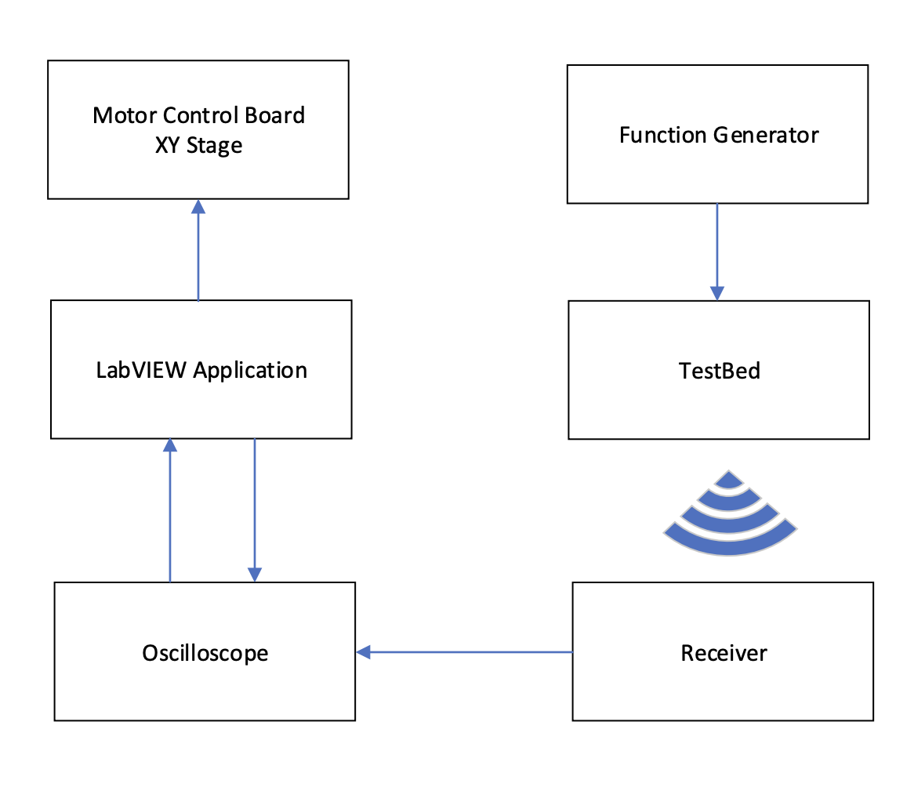

# UltrasonicXYStage

The XYStage program perfroms a scan of a custom grid (rows and columns) of transmitters and returns each phase and amplitude.

Developed in LabVIEW 2016.

##### Top LLB: phaseMeasure_tkdpo4k.llb

##### Top VI: XY_PhaseMeasure_Main

##### **Acknowledgements:**

Dr. Lee Davis - For the initial design of the program controlling basic movement

##### Instruments Required:

- XY Stage comprised of:
  - Programmable Stepper Motor Control Board (RS 440-098)
  - Control Software (RS 440-105)
  - 2x RS 191-8378 Stepper Motors
- TKDPO Oscilloscope
  - DPO 3012 was used, but any generic 2000-4000 series scope should be compatible
  - Hi-Res Acquisition mode
- Function generator
  - AFG 31000 Function Generator, a different generator can be used
  - 3.3 Vpp square wave with 1.65V offset used as the driving signal
- Test Rig for transducers
  - 10x10 Transducer test bed used with 25mm spacing between transmitters
  - 100 Manorshi 10mm 40khz piezo ultrasonic Transmitter
  - 2xTC4427A drivers were used, with the 4 channels driving 100 transducers in total
  - Signals were split across rails
  - 12V used for driver Vdd
- Mount for receiver
  - Adjustable Z axis may be used to position receiver as close as possible to the transmitters without obstruction
  - Laser pointer attached to mount to align the test rig to the XY axes, not needed if perfect alignment is already ensured

##### Operation

- The program is flexible and allows users to setup custom stages with the following values: scan-sizes, step-sizes and stage sizes
- The user should ensure the rig is aligned to the XY bed and run tests to verify the direction of the scan
- The user should ensure that the oscilloscope is connected via Serial-USB and the correct acquisition mode as well as a delay time is provided

##### Output

- For each scan, a CSV file is created in the chosen directory. A timestamp is attached to differentiate runs.
- A configuration file containg the setup information is also created, to replicate the run if needed.
- The CSV file contains the indexes, postions, phase and amplitudes of each scan point.
